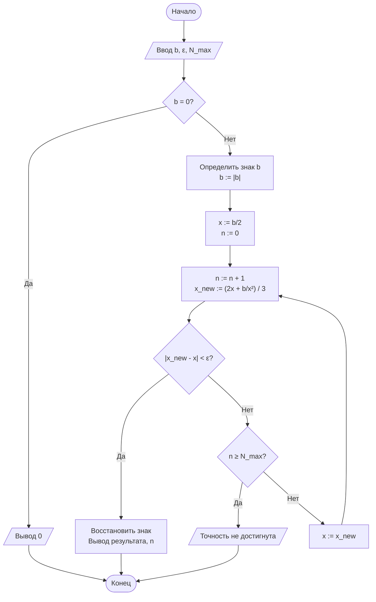

# Блок-схема: вычисление ∛b (вариант 6)

```mermaid
flowchart TD
    A([Начало]) --> B[/Ввод b, ε, N_max/]
    B --> C{b = 0?}
    C -- Да --> D[/Вывод 0/] --> Z([Конец])
    C -- Нет --> E["Определить знак b<br/>b := |b|"]
    E --> F["x := b/2<br/>n := 0"]
    F --> G["n := n + 1<br/>x_new := (2x + b/x²) / 3"]
    G --> H{"|x_new - x| < ε?"}
    H -- Да --> I["Восстановить знак<br/>Вывод результата, n"] --> Z
    H -- Нет --> J{"n ≥ N_max?"}
    J -- Да --> K[/Точность не достигнута/] --> Z
    J -- Нет --> L["x := x_new"] --> G
```
